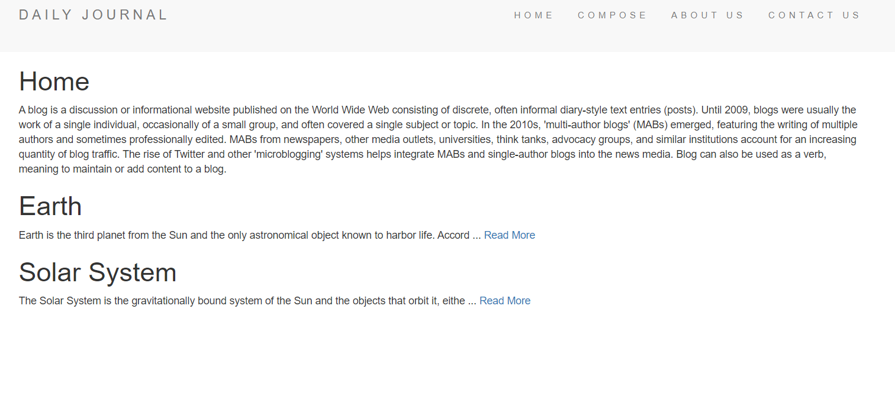
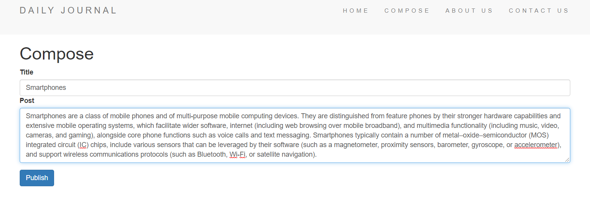

# Blog
📝 A blog website where the user can post their blog and review them later.

# General Information
The website is developed to post blogs along with the title of the blog.
The home page shows a 100 letter summary of the blog followed by a Read More link which redirects to the complete blog.

# Tech Stack Used

1) HTML

2) CSS

4) JavaScript

6) EJS

8) Node.js

10) Express.js

12) MongoDB

# Screenshots

### Home

### Compose

